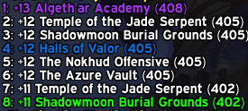
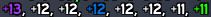

Pluslist
========

A barebones addon for World of Warcraft: Shadowlands that prints your top M+
runs for the week to the default chat window, highlighting the runs that
determine your rewards from The Great Vault (highlighted in green).

Usage
-----

`/pluslist` - Long form table listing keystone level, dungeon name, and Great
Vault reward.

`/pl` - Short form comma-separated list of keystone levels

